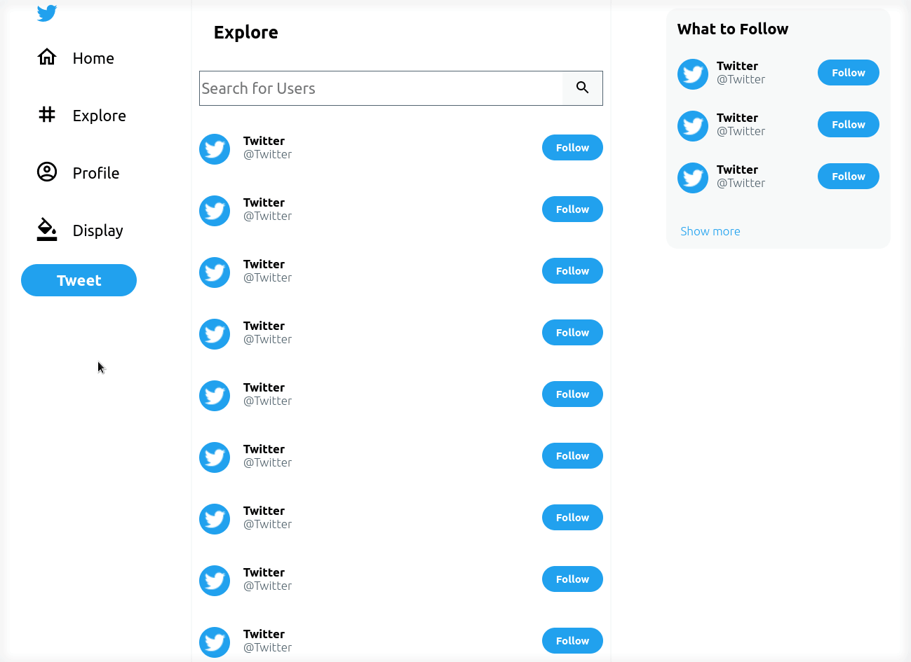

<h1 style="text-align:center">Twitter Ui Clone made with React.JS 💙</h1>
<h4 style="text-align:center">Core of application is the styled-components</h4>
<h4 style="text-align:center">and has a lot of cool things like Material UI and Context API</h4>

